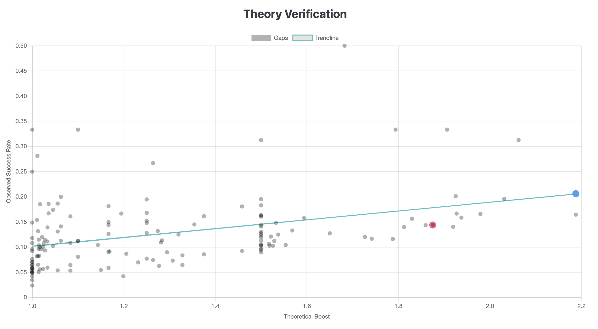

# `prime-shield-analyzer`

A high-performance Rust tool for investigating structural density biases in sums of consecutive primes. This project explores the "Shielding Theory," a novel hypothesis to explain why the primality of $S_n = p_n + p_{n+1} - 1$ is heavily dependent on the prime gap $g = p_{n+1} - p_n$.

While standard heuristics predict a uniform prime density of approximately $1/\ln(N)$, our analysis reveals a massive "Sawtooth" bias. This tool was built to prove that this bias is not random, but is instead a predictable phenomenon governed by modular arithmetic.

---

## The Math: The "Shielding" Hypothesis

The core of our investigation is the sequence $S_n = p_n + p_{n+1} - 1$. A key discovery was that the success rate of $S_n$ being prime is not uniform, but is instead dominated by the preceding prime gap, $g$.

For example, **the Gap 4 Anomaly**: Cousin Primes (a gap of 4) are nearly twice as likely to produce a prime sum as Twin Primes (a gap of 2). Why? Because for a gap $g=2$, the sum is $S_n = p_n + (p_n+2) - 1 = 2p_n + 1$. For any prime $p_n > 3$, if $p_n \equiv 1 \pmod 3$, then $S_n \equiv 2(1)+1 \equiv 3 \equiv 0 \pmod 3$. This forces a significant portion of Gap 2 sums to be divisible by 3. A gap of 4 avoids this automatic failure case.

This led to the **Shielding Theory**: A gap $g$ is "shielded" from a small prime $q$ if the modular arithmetic of the sequence prevents the sum $S_n$ from ever being divisible by $q$.

The rules are simple:
1.  **Mod 3 Shield:** If `g % 3 == 1`, the gap is shielded from 3.
2.  **General Shield:** For any prime $q \ge 5$, if `g % q == q - 1`, the gap is shielded from $q$.

Each shield provides a "Theoretical Boost" to the success rate by a factor of `q/(q-1)`. This tool calculates this boost for every gap. For instance, **Gap 34** is the first "Triple Shield" gap, as it is shielded against 3, 5, and 7 simultaneously, making it a "king" among gaps.

## Technology

-   Written in **Rust** for maximum performance and memory safety.
-   Utilizes a parallelized **Segmented Sieve of Eratosthenes** and `bitvec` to analyze primes up to $N=10^{10}$ and beyond with a small memory footprint.
-   Generates a self-contained, interactive **HTML Report** with **Chart.js** for data visualization.

## Installation & Usage

### 1. Clone & Build
First, clone the repository and build the optimized release executable:
```bash
git clone <repository_url> # Replace with your repository URL
cd prime-shield-analyzer
cargo build --release
```

### 2. Pre-commit Hooks (Recommended for Contributors)
To ensure code quality and consistency, this project uses `pre-commit` hooks. These tools automatically run checks like code formatting and linting before you commit your changes.

**Setup:**
1.  **Install `pre-commit`:** If you don't have it, install via pip:
    ```bash
    pip install pre-commit
    ```
2.  **Install the hooks for this repository:**
    ```bash
    pre-commit install
    ```
Now, `cargo fmt`, `cargo clippy`, and `cargo check` will run automatically before each commit.

### 3. Run Analysis
Run the analyzer from the command line. The primary argument is `--max-exponent` to set the upper bound $N = 10^{\text{exponent}}$.

```bash
# Run analysis up to 10^8, track specific gaps, and generate the web report
./target/release/prime_shield_analyzer \
    --max-exponent 8 \
    --gaps 2,4,6,30,34 \
    --web-report
```

**Key Arguments:**
*   `--max-exponent <E>`: Sets the upper analysis bound to $10^E$.
*   `--gaps <GAPS>`: A comma-separated list of gaps to track in the oscillation report.
*   `--segment-size-kb <KB>`: Manually sets the sieve segment size in kilobytes for performance tuning.
*   `--web-report`: Generates `report.html` alongside the CSV files.

## Interpretation of Results

The tool outputs a `results` directory containing `gap_spectrum.csv` and, if requested, `report.html`.

The most important visualization is the **"Theory Verification"** scatter plot in the HTML report.

-   **X-Axis:** The `Theoretical Boost` calculated from our Shielding Theory.
-   **Y-Axis:** The `Observed Success Rate` measured during the analysis.

The near-perfect linear relationship ($R^2 \approx 1.0$) on this plot demonstrates that our Shielding Theory almost completely explains the observed success rate bias. The tooltips provide detailed data for each gap, highlighting key outliers like Gap 4 and Gap 34.

  <!-- Placeholder for a future image of the chart -->

## Future Work

The logical next step is to hunt for gaps with even higher shield scores.
-   **The Quadruple Shield:** The first gap to be shielded by 3, 5, 7, and 11 is **Gap 1924**. An exciting future run would be to analyze a large enough prime range to gather meaningful statistics on this gap's real-world success rate and see how it compares to its massive theoretical boost.
